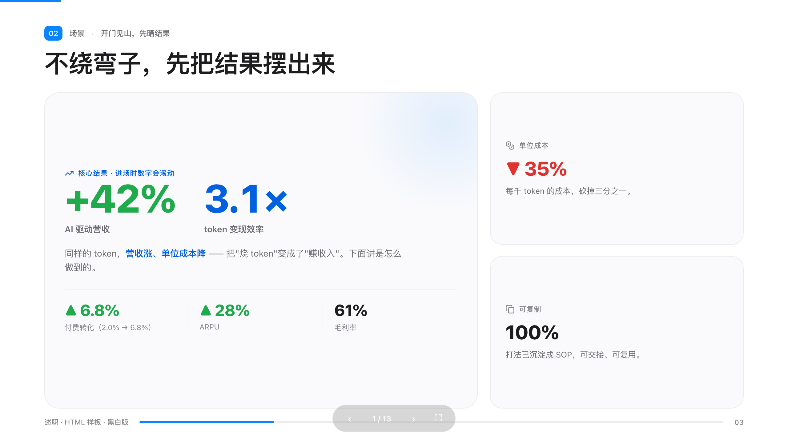
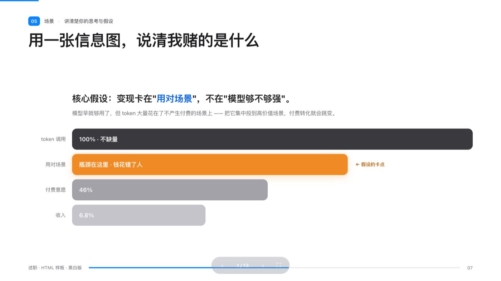
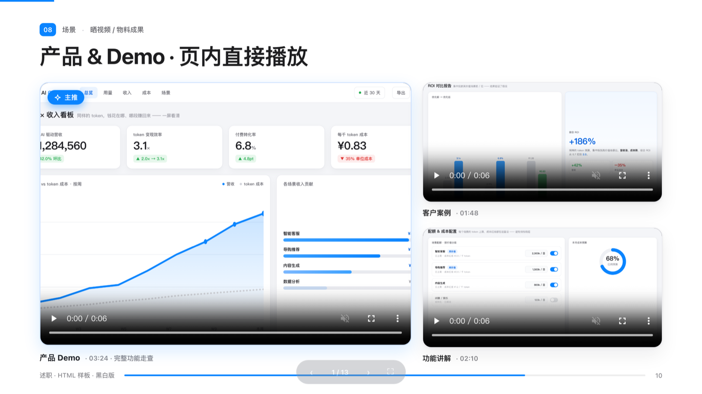

# 阿亮 · 述职 HTML PPT （aliang-shuzhi-html-ppt）

**一套专门为「述职 / 汇报」做的 HTML 版 PPT 模板 + 设计系统**，交给 AI Agent（Claude Code / Codex /
Cursor…）来用。产物是一个 `index.html`，浏览器全屏打开就能放映 —— 不用 PowerPoint，不用 Keynote。

设计语言参考了 **苹果官网（apple.com）** 的风格：SF Pro + 苹方字体、克制的配色、柔和的多层阴影、大量留白、
每页一个视觉重点。**默认是黑白商务蓝主题，但品牌色可以随便换** —— 改几个 token 就能换成你自己公司的品牌色或别的风格。

它不是一个"填空式模板"，而是一套**设计系统 + 工作流**：你把素材给 Agent，它按规则把整套 PPT 搭出来；换主题改
几个颜色，换内容改文字，**结构和那股"苹果质感"直接复用**。


---

## 这套模板能解决什么

述职做 PPT，传统流程又慢又费神：整数据一天、抠排版对齐一天，还得跟同事一样卷模板。换成 AI 做 HTML 之后：

- **改东西基本靠一张嘴** —— 对齐、挪位置、改措辞，一句话的事。
- **视觉天花板更高** —— 放图、加动画、内嵌视频都简单，本质就是个网页。
- **批量改一句话全改** —— 某个词写错了，一次性全替换，不用一页页翻。
- **顺手给一份演讲腹稿** —— Agent 知道你每页要讲什么，出口播稿几乎是免费的。
- **分发简单** —— 打包成压缩包发出去，对方解压点 `index.html` 就能放。

但有个坑：AI 第一版"自以为好看"的东西，往往一股塑料 AI 味 —— 花花绿绿的 emoji 图标、到处都是色块卡片。
**这套 skill 就是把那股味儿摁住的一整套规则。**

## 截图（样片为脱敏示例，产品/数字均虚构）

<table>
<tr>
<td width="50%"></td>
<td width="50%"></td>
</tr>
<tr>
<td></td>
<td></td>
</tr>
<tr>
<td></td>
<td></td>
</tr>
<tr>
<td></td>
<td></td>
</tr>
</table>

## 三个关键（做好一份述职 PPT 的要点）

1. **先把"怎么分页"定下来，再动手。** 别甩一坨文字让模型自己猜分页 —— 它按感觉拆，你来回返工。先给它结构化
   输入（一个主题一块：背景 · 目标 · 关键数据 · 思考 · to-do），或者一起把大纲理出来，再生成。
2. **抄大厂官网的设计语言，禁用 emoji。** 别教模型"审美" —— 直接让它学 apple.com（或你/你老板都认可的品牌）。
   并且明确禁止用 emoji 当图标（这是廉价 AI 味的头号来源），改用一套开源线性图标。
3. **动画和炫技要克制。** 述职场景，内容权重永远大于呈现。挑一两个最想让老板记住的地方稍微亮一下技术，其余保持
   安静。业绩硬 + 一点恰到好处的呈现 = 锦上添花；业绩一般还堆一堆炫酷动画 = 帮倒忙。

## 安装：整个仓库就是这个 skill（要全下，不是只拿 SKILL.md）

**`SKILL.md` 只是入口，不能单独用。** 它会按需引用 `references/`、`templates/`、`examples/`、`scripts/`
里的文件 —— 单独一个 `SKILL.md` 跑不起来。所以请 **clone / 下载整个仓库**：

- **Claude Code** —— clone 到 skills 目录，会被自动发现：
  ```bash
  git clone https://github.com/aurthur/aliang-shuzhi-html-ppt \
    ~/.claude/skills/aliang-shuzhi-html-ppt
  ```
- **其它 Agent（Codex / Cursor / 网页版）** —— 把整个仓库下到本地，让 Agent 从 `SKILL.md` 起步
  （它会自己去读同目录下的 references / templates / examples）。
- **只想先看效果** —— 直接打开 `examples/business-deck/index.html`，不用装。

## 怎么用

1. 装好后，跟 Agent 说：*"基于这份材料，帮我做个述职用的 HTML PPT。"*
2. Agent 会按 `SKILL.md` 走：搞清目标和受众 → **先和你确认逐页结构** → 选主题（不指定就用默认那套）→ 从
   `templates/deck-template.html` 搭 → 用 `scripts/validate-deck.sh` 自检 → 打包。
3. 想先看效果：打开 `examples/business-deck/index.html`（← / → 翻页，`F` 全屏）。

## 换成你自己的品牌 / 风格

所有可改的颜色都在 `:root` 里以 token 形式存在。**默认是苹果蓝商务主题**；要换：

- 改 `--accent` 及它的 `-d / -soft / -line` 几档，再改封面/分隔页/结尾的渐变 —— 就这些。
- 例：企业绿 `#1f9a40`、紫色 `#6E56F0`、极光多色渐变（只在章节页用）。
- 中性色、阴影、圆角保持不变 —— 那是"苹果质感"的根。
- Logo：把占位的 `<div class="lg">…</div>` 换成你的 ``。

**不指定就用默认那套**，Agent 会告诉你这是默认色、随时能换。

## 仓库结构

```
aliang-shuzhi-html-ppt/
├── SKILL.md                       # Agent 入口：工作流 + 布局菜单 + 构建 checklist
├── references/
│   ├── design-system.md           # 设计 token：配色 · 字体 · 间距 · 阴影 · 动效 · 数字
│   ├── design-principles.md       # do's & don'ts + 硬禁忌项
│   ├── brand-review.md           # 品牌色「约束(角色+比例+≤2上限) + 每页/整体审查」机制
│   ├── components.md             # 一套封闭的「命名布局」菜单
│   ├── workflow.md              # 需求 → 确认分页 → 搭建 → 自检 → 打包
│   └── verify.md                # 溢出 / 动画同步 / 违规模式自检
├── templates/
│   └── deck-template.html         # 可换主题的空白脚手架（引擎 + 全套 CSS + 占位页）
├── examples/business-deck/        # 一份完整、已脱敏的样片（参照基准）
│   ├── index.html · assets/ · _mocks/   # _mocks 是用无头 Chrome 渲染真实截图的源码
└── scripts/
    └── validate-deck.sh           # 按硬规则 lint 一份 deck
```

> 这个目录结构遵循 **Anthropic「Agent Skills」约定**：`SKILL.md` 作入口，`references/` `scripts/`
> 等做「渐进式披露」（Agent 先读 SKILL.md，需要时才展开深层文件）。设计系统文档的分章参考了
> **Open Design** 项目的 `DESIGN.md` 九段式（配色 / 字体 / 间距 / 动效 / 反面样式…）。
> **整个文件夹是一个 skill —— 一起用，别只拿 `SKILL.md`。**

## 设计系统要点

- **苹果字体、不联网**：`-apple-system / SF Pro Display + 苹方 PingFang SC`，系统自带，离线/投屏都稳
  （SF Pro 不能合法网络内嵌，所以走系统回退链）。
- **克制配色**：近中性底 + 近黑正文 + **一个强调色**。品牌色只出现在数字、小标签、图标徽章、关键词、章节页渐变。
- **数字是一等规则**：▲ 绿=增、▼ 红=减、每个数据页只留**一个品牌蓝的旗舰数字**；进场数字滚动。
- **柔和多层阴影**、18–22px 圆角、大留白、每页一个焦点。
- **每个 deck 只留一个招牌动画**（比如那个会转的飞轮）—— 点缀，不是主菜。

## 硬禁忌（即使随口要求也不做）

- ❌ 用 emoji 当图标 → 改用一套开源线性图标（SVG sprite）。
- ❌ 卡片左边带竖色块（最像 AI 生成的样式）。
- ❌ 把每句观点都套进卡片 → 观点是大字 + 一个染色关键词，不是色块。
- ❌ 述职场景里满屏炫技动画。

`scripts/validate-deck.sh` 会自动卡前三条。

---

## English

**A purpose-built HTML deck template + design system for performance reviews & reports (述职 / 汇报)**,
driven by a coding agent (Claude Code / Codex / Cursor…). The output is a single `index.html` that
plays full-screen in any browser — no PowerPoint, no Keynote.

The visual language emulates **apple.com**: SF Pro + PingFang SC type, restrained color, soft layered
shadows, generous whitespace, one focal point per slide. The default is a black-&-white business-blue
theme, but **brand colors are fully swappable** — change a few tokens to re-brand to your company's
colors or another style.

It's a **design system + workflow**, not a fill-in template: hand the agent your material and it
assembles the whole deck by the rules; re-theme by changing colors, re-content by changing text —
**the structure and the Apple-grade polish are reused.** *(Screenshots: see the gallery near the top —
the sample is a fully fictional / desensitized example.)*

### What it solves
Making a review deck the old way is slow — a day on data, a day fighting alignment and templates. With
an AI building HTML instead:
- **Edit by voice** — align, move, reword: one sentence does it.
- **Higher visual ceiling** — images, motion, inline video are easy; it's a web page.
- **Batch edits in one shot** — a wrong word fixed everywhere at once.
- **A speaker-notes draft for free** — the agent already knows every slide's intent.
- **Simple to share** — zip it; the recipient unzips and opens `index.html`.

The catch: the AI's *first* "looks-good" draft is usually plastic AI slop — emoji icons, a tinted box
around everything. **This skill is the full set of rules that kills that look.**

### Three keys (to a good review deck)
1. **Pin the pagination before building.** Don't dump prose and let the model guess the page split —
   give it structured input (one block per topic: background · goal · key data · thinking · to-do), or
   outline it together first.
2. **Emulate a top brand's design language; ban emoji.** Don't teach the model "taste" — point it at
   apple.com. Forbid emoji icons (the #1 cheap-AI tell); use one open-source line-icon set.
3. **Keep animation restrained.** In a review, content outranks form. Let one or two moments shine and
   keep the rest calm.

### Install (the whole repo IS the skill)
`SKILL.md` is only the entry point — it references `references/`, `templates/`, `examples/`,
`scripts/` and does nothing alone. **Clone the whole repo:**
- **Claude Code** — clone into the skills dir (auto-discovered):
  ```bash
  git clone https://github.com/aurthur/aliang-shuzhi-html-ppt ~/.claude/skills/aliang-shuzhi-html-ppt
  ```
- **Other agents (Codex / Cursor / web)** — clone the repo locally and point the agent at `SKILL.md`.
- **Just want to look** — open `examples/business-deck/index.html`, no install needed.

### How to use
1. Tell the agent: *"Build me an HTML review deck from this material."*
2. It follows `SKILL.md`: clarify goal & audience → **confirm a page-by-page outline with you** →
   theme (defaults to the bundled palette) → build from `templates/deck-template.html` → self-check
   with `scripts/validate-deck.sh` → package.
3. Preview anytime: open `examples/business-deck/index.html` (← / → to navigate, `F` for full-screen).

### Re-brand to your own colors / style
Every brandable color is a `:root` token. **Default = Apple-blue business.** To change:
- Edit `--accent` (+ its `-d / -soft / -line` shades) and the cover/divider/closing gradient — that's it.
- E.g. corporate green `#1f9a40`, violet `#6E56F0`, or a multi-color / aurora scheme (chapter pages only).
- Neutrals, shadows, and radius stay put — that's the root of the Apple feel.
- **Multi-color brand** (Google / Microsoft…)? Don't just change one token — see
  `references/brand-review.md`: a flowing corner brand-mark + chapter gradients + soft palette tints on
  the small sets, bounded by a ≤2-accent-per-slide cap and a per-page + whole-deck review.

If you don't choose, the agent uses the default and tells you it's swappable.

### Repo structure & design highlights
See the structure tree above. The layout follows **Anthropic's Agent Skills** convention (`SKILL.md`
entry + progressive disclosure); the design-system doc borrows **Open Design**'s `DESIGN.md` schema.
Highlights:
- **System Apple fonts, no web-font** — offline / projector-safe (SF Pro can't be web-embedded, so it's
  a fallback chain).
- **Restrained color** — near-neutral surface + near-black text + one accent; brand color only on
  numbers, labels, badges, keywords, and chapter-page gradients.
- **Numbers as a first-class rule** — ▲ green = up, ▼ red = down, one brand-blue flagship per data
  page; numbers count up on entry.
- **Soft layered shadows**, 18–22px radius, generous whitespace, one focal point per slide.
- **One signature animation per deck** (e.g. the flywheel) — a garnish, not the dish.

### Non-negotiables
- ❌ Emoji as icons → one open-source line-icon set (SVG sprite).
- ❌ A card with a left vertical color bar (the most AI-generated-looking pattern).
- ❌ Boxing every statement → a viewpoint is large text + one colored keyword, not a tinted box.
- ❌ Showy, deck-wide animation in a review.

`scripts/validate-deck.sh` enforces the first three (plus the AI-slop default palette).

## License

[MIT](LICENSE) © 2026 Arthur Wu. 样片完全虚构 / 脱敏 —— "AI Console" 产品与所有数字均为示意。
